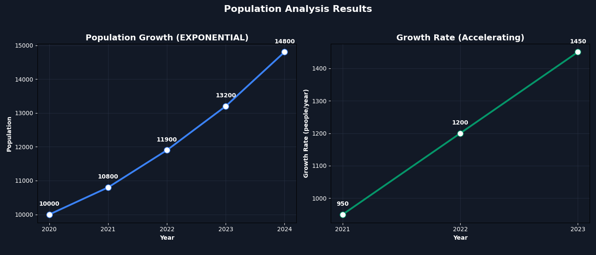
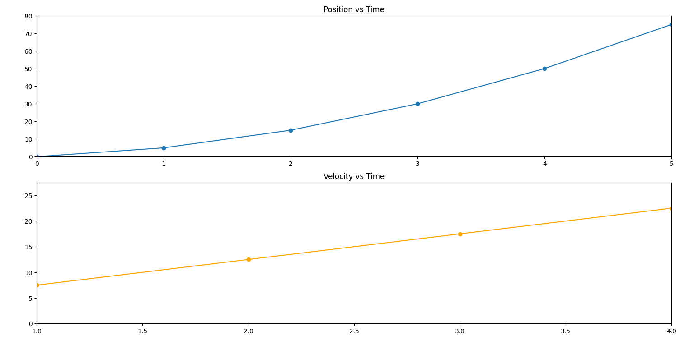
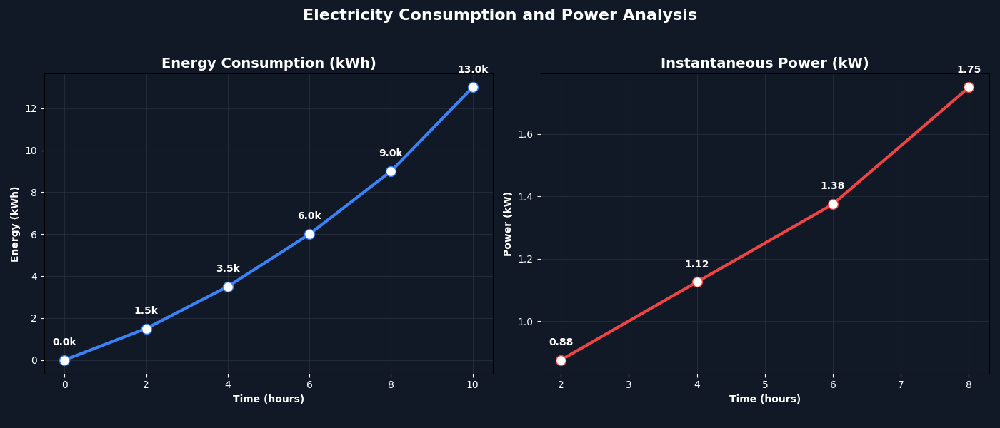

# Computational_Science_FinalsAct1
# Numerical Methods Case Studies

## Case 1: Population Growth Analysis
This study analyzes local government population trends using numerical methods because only discrete yearly data was available. We applied the Central Difference formula to estimate annual growth rates and the Trapezoidal Rule to determine the total cumulative population over the 2020–2024 period, resulting in 48,300 person-years.

## Case 2: Traffic Flow and Velocity Estimation
This case examines a traffic monitoring system where vehicle position is recorded every second. We employed numerical differentiation (Central Difference) to compute velocity and acceleration, and the Trapezoidal Rule to verify the total distance traveled, demonstrating that the vehicle's motion was not uniform as velocity changed consistently.

## Case 5: Electricity Consumption and Power Analysis
This analysis focuses on household electricity consumption data recorded throughout the day. We used numerical differentiation (Central Difference) to determine instantaneous power usage and the Trapezoidal Rule to calculate total energy consumption over a 10-hour period, identifying peak usage at the 8-hour mark.

